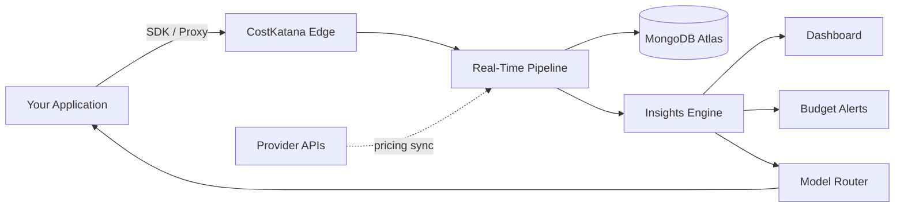

<p align="center">
  
</p>

<h1 align="center">CostKatana</h1>

<p align="center">
  <strong>AI cost intelligence for the teams shipping AI.</strong>
</p>

<p align="center">
  Track every token. Attribute every dollar. Cut your AI bill without cutting features.
</p>

<p align="center">
  <a href="https://costkatana.com">Website</a> ·
  <a href="https://app.costkatana.com">App</a> ·
  <a href="https://docs.costkatana.com">Docs</a> ·
  <a href="https://status.costkatana.com">Status</a>
</p>

<p align="center">
  <a href="https://www.npmjs.com/package/cost-katana"></a>
  <a href="https://www.npmjs.com/package/cost-katana-cli"></a>
  <a href="https://pypi.org/project/cost-katana/"></a>
  <a href="https://github.com/costkatana"></a>
  
</p>

---

## What is CostKatana

CostKatana is an AI cost intelligence platform. It sits between your application and your model providers (OpenAI, Anthropic, AWS Bedrock, Google) and gives you the visibility, attribution, and control that your AI bill currently lacks.

Think of it as the missing observability layer for LLM spend: real-time dashboards, prompt-level attribution, and an insights engine that surfaces what to optimize next.

## Why it exists

Most teams discover what their AI feature actually costs only at the end of the month, in a single line item from a provider invoice, with no breakdown by feature, customer, or prompt. By the time the bill arrives, you have burned cash on prompts that could have been compressed, calls that could have been cached, and models that were 5x more expensive than necessary for the task.

CostKatana flips that. Cost becomes a first-class signal you can monitor, alert on, and attribute, just like latency or error rate.

## Features

- **Multi-provider cost tracking.** Unified view across OpenAI, Anthropic, AWS Bedrock, Google, and more.
- **Token-level attribution.** Cost per request, per prompt, per user, per feature, per tenant.
- **Smart insights engine.** Automated recommendations: cheaper model swaps, prompt compression, cache opportunities, retry waste.
- **Experimentation suite.** Cost simulator, model leaderboard, what-if scenarios, and head-to-head model comparison before you ship.
- **Budget alerting.** Real-time alerts on thresholds at the team, feature, or tenant level.
- **Model routing.** Route by cost, latency, and quality constraints. Swap providers without touching application code.
- **Multi-tenant by design.** Built for platforms and agencies managing AI spend across many products or clients.
- **Vectorless RAG instrumentation.** First-class cost attribution for retrieval pipelines, not just chat completions.

## Quick start

### JavaScript / TypeScript

```bash
npm install cost-katana
```

```typescript
import { CostKatana } from 'cost-katana';
import OpenAI from 'openai';

const ck = new CostKatana({ apiKey: process.env.COSTKATANA_API_KEY });
const openai = new OpenAI();

const result = await ck.track(
    { provider: 'openai', model: 'gpt-4o', feature: 'support-bot', userId: 'user_42' },
    () => openai.chat.completions.create({
        model: 'gpt-4o',
        messages: [{ role: 'user', content: 'Hello' }]
    })
);
```

### Python

```bash
pip install cost-katana
```

```python
import os
from cost_katana import CostKatana
from anthropic import Anthropic

ck = CostKatana(api_key=os.environ["COSTKATANA_API_KEY"])
client = Anthropic()

with ck.track(provider="anthropic", model="claude-opus-4", feature="rag-pipeline"):
    response = client.messages.create(
        model="claude-opus-4",
        max_tokens=1024,
        messages=[{"role": "user", "content": "Hello"}]
    )
```

### CLI

```bash
npm install -g cost-katana-cli
cost-katana login
cost-katana costs --last 7d --group-by feature
cost-katana insights --tenant acme-corp
```

Full SDK reference at [docs.costkatana.com](https://docs.costkatana.com).

## How it works



The SDK adds near-zero-overhead instrumentation around your provider calls. Events stream to a real-time pipeline where the insights engine aggregates spend, detects anomalies, and feeds optimization signals back to the model router. The dashboard typically reflects new traffic within seconds.

## Use cases

| Who | Problem | What CostKatana gives them |
|---|---|---|
| AI-native startups | No visibility into per-user unit economics | Cost attribution per user, per feature, ready before you raise the next round |
| Enterprise platform teams | Multiple business units sharing one provider account | Chargeback-ready reports with budget governance |
| Agencies and dev shops | AI spend mixed across many client projects | Multi-tenant attribution and per-client invoicing inputs |
| RAG and agent teams | No insight into which retrieval or tool steps are worth their tokens | Step-level cost traces across the full pipeline |

## Ecosystem

| Package | Purpose | Install |
|---|---|---|
| [cost-katana](https://www.npmjs.com/package/cost-katana) | JavaScript / TypeScript SDK | `npm install cost-katana` |
| [cost-katana](https://pypi.org/project/cost-katana/) | Python SDK | `pip install cost-katana` |
| [cost-katana-cli](https://www.npmjs.com/package/cost-katana-cli) | Command-line tool | `npm install -g cost-katana-cli` |

## Documentation

- [Getting started](https://docs.costkatana.com/getting-started)
- [SDK reference](https://docs.costkatana.com/sdk)
- [Insights engine](https://docs.costkatana.com/insights)
- [Experimentation](https://docs.costkatana.com/experimentation)
- [API reference](https://docs.costkatana.com/api)

## Roadmap

- Native integrations for LangChain, LlamaIndex, and CrewAI
- Vectorless RAG cost attribution at the chunk and reranker level
- VPC-isolated and on-prem deployment for regulated industries
- Cost-aware model router with SLA guarantees
- Streaming cost telemetry for sub-second budget enforcement

## Tech stack

| Layer | Technologies |
|---|---|
| Frontend | React, Next.js, TailwindCSS |
| Backend | Node.js, NestJS, Express, TypeScript |
| Cloud | AWS ECS, Lambda, Bedrock, MongoDB Atlas, ElastiCache (Redis) |
| Integrations | OpenAI, Anthropic, AWS Bedrock, Google AI |
| Distribution | NPM, PyPI, Homebrew (planned) |

## Status and reliability

System health, incidents, and SLA history at [status.costkatana.com](https://status.costkatana.com).

## Contributing

We welcome issues, discussions, and pull requests. Please read [CONTRIBUTING.md](./CONTRIBUTING.md) and our [Code of Conduct](./CODE_OF_CONDUCT.md) before opening a PR. For security disclosures, email [support@costkatana.com](mailto:support@costkatana.com).

## Maintainers

CostKatana is built and maintained by Abdul Sagheer and the CostKatana team out of Bangalore, with customers across India, the Gulf, and the US.

- Email: [support@costkatana.com](mailto:support@costkatana.com)
- Website: [costkatana.com](https://costkatana.com)
- Careers: [costkatana.com/careers](https://costkatana.com/careers)

## License

Apache License 2.0. See [LICENSE](./LICENSE) for the full text.

---

<p align="center">
  <i>Make AI cost visibility as native as observability.</i>
</p>
